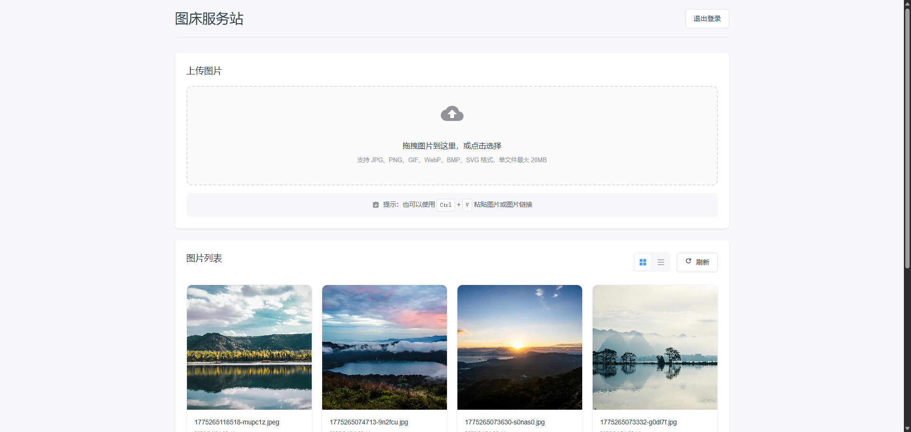

# Cf-Github-ImgBed

一个基于Cloudflare Workers & Github API的简易图床服务

---

## 简介

Cf-Github-ImgBed 是一个基于 Cloudflare Workers 和 Github API 的简易图床服务。它允许用户通过简单的 HTTP 请求将图片上传到 Github 仓库，并返回图片的 URL。这个服务可以用于在博客、社交媒体或其他需要快速分享图片的场景中。

## 功能

 - 图片上传：
   - 支持拖拽上传
   - 支持粘贴上传
   - 支持URL上传
 - 图片展示：
   - 支持图片预览
   - 支持图片缩放
 - 图片管理：
   - 支持图片删除

## 预览

## 部署

[点此查看]()

## 注意事项

 - 确保你已经创建了一个 Github 仓库
 - 确保你已经创建了一个含`repo`权限的Github Token
 - 确保你已经部署了 Cloudflare Workers 并且设置了环境变量

## 日志

 - 2026-04-03：更新了1.0版本

## 未来计划

 - 暂无（可通过微信公众号或者Issue反馈）

